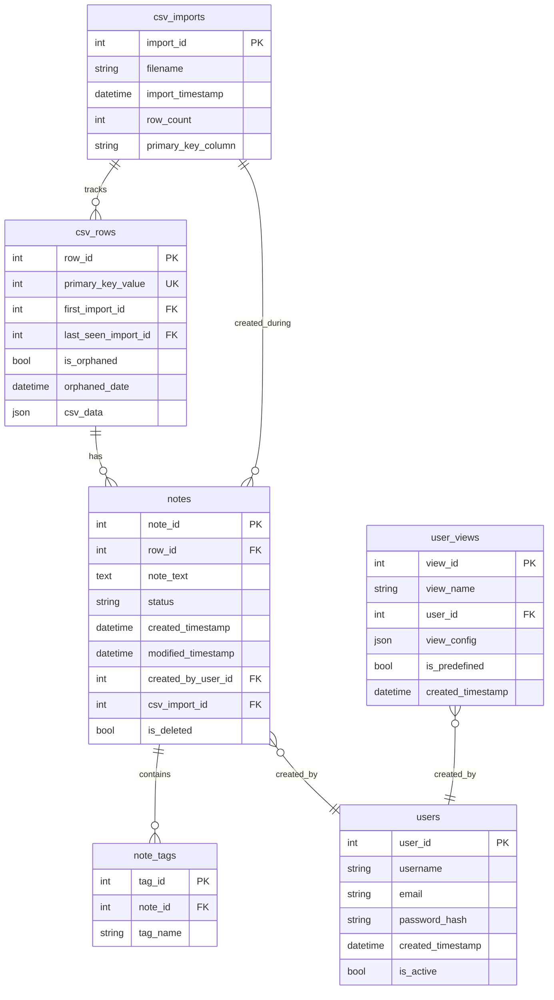

# CSV Notes Manager - Technical Architecture

**Version:** 1.0  
**Last Updated:** 2025-11-04  
**Status:** Architecture Design

---

## 1. Executive Summary

The CSV Notes Manager is a web-based application designed to maintain persistent notes on CSV file rows across multiple file versions. The architecture supports both local desktop deployment (single .exe) and containerized deployment (Docker) from the first working version.

### 1.1 Core Architecture Principles

- **Deployment Flexibility**: Support both standalone .exe and Docker deployment from day one
- **Progressive Enhancement**: Start minimal, add features incrementally
- **Always Deployable**: Every development step produces a working, testable version
- **Future-Ready**: Designed for easy migration to multi-user, cloud-hosted deployment
- **Data Integrity**: Zero data loss, full audit capability

---

## 2. System Overview

### 2.1 High-Level Architecture

```
┌─────────────────────────────────────────────────────────────┐
│                      Client Layer                            │
│  ┌────────────────────────────────────────────────────────┐ │
│  │   Web Browser (Chrome, Firefox, Edge, Safari)         │ │
│  │   - React SPA (Single Page Application)                │ │
│  │   - Ant Design UI Components                           │ │
│  │   - Redux State Management                             │ │
│  └────────────────────────────────────────────────────────┘ │
└─────────────────────────────────────────────────────────────┘
                           ↕ HTTP/REST
┌─────────────────────────────────────────────────────────────┐
│                   Application Layer                          │
│  ┌────────────────────────────────────────────────────────┐ │
│  │   FastAPI Backend (Python 3.10+)                       │ │
│  │   - RESTful API Endpoints                              │ │
│  │   - Business Logic Layer                               │ │
│  │   - CSV Processing (pandas)                            │ │
│  │   - Export Generation                                  │ │
│  └────────────────────────────────────────────────────────┘ │
└─────────────────────────────────────────────────────────────┘
                           ↕ SQLAlchemy ORM
┌─────────────────────────────────────────────────────────────┐
│                     Data Layer                               │
│  ┌────────────────────────────────────────────────────────┐ │
│  │   SQLite Database                                      │ │
│  │   - CSV Import Tracking                                │ │
│  │   - Row Data Storage (JSON)                            │ │
│  │   - Notes & Tags                                       │ │
│  │   - View Configurations                                │ │
│  └────────────────────────────────────────────────────────┘ │
└─────────────────────────────────────────────────────────────┘
```

### 2.2 Deployment Models

#### Model A: Standalone Desktop Application
```
┌──────────────────────────────────────┐
│   CSVNotesManager.exe                │
│   ├── Python Runtime (embedded)      │
│   ├── FastAPI Server                 │
│   ├── SQLite Database                │
│   └── React Frontend (static files)  │
└──────────────────────────────────────┘
        ↓ Launches on port 8080
┌──────────────────────────────────────┐
│   User's Default Browser             │
└──────────────────────────────────────┘
```

#### Model B: Docker Container (from v0.1.0)
```
┌──────────────────────────────────────┐
│   Docker Container                   │
│   ├── Python 3.10 Alpine             │
│   ├── FastAPI Server                 │
│   ├── Volume: /app/data              │
│   │   └── notes.db (SQLite)          │
│   └── React Frontend (served)        │
└──────────────────────────────────────┘
        ↓ Exposed on port 8080
┌──────────────────────────────────────┐
│   Host Machine Browser               │
└──────────────────────────────────────┘
```

---

## 3. Technology Stack

### 3.1 Backend Stack

| Component | Technology | Version | Justification |
|-----------|-----------|---------|---------------|
| **Language** | Python | 3.10+ | Rich ecosystem, excellent data processing libraries |
| **Web Framework** | FastAPI | 0.104+ | Modern, async, auto-documentation, type hints |
| **ORM** | SQLAlchemy | 2.0+ | Flexible, supports SQLite and PostgreSQL migration |
| **Database** | SQLite | 3.x | Serverless, zero-config, perfect for local/embedded use |
| **CSV Processing** | pandas | 2.0+ | Industry standard for data manipulation |
| **Validation** | Pydantic | 2.0+ | Type-safe validation (built into FastAPI) |
| **Testing** | pytest | 7.0+ | Comprehensive Python testing framework |
| **Packaging** | PyInstaller | 5.0+ | Creates standalone executables |

### 3.2 Frontend Stack

| Component | Technology | Version | Justification |
|-----------|-----------|---------|---------------|
| **Framework** | React | 18.x | Component-based, large ecosystem, excellent tooling |
| **UI Library** | Ant Design | 5.x | Enterprise-grade tables, comprehensive components |
| **State Management** | Redux Toolkit | 2.0+ | Simplified Redux, excellent debugging |
| **HTTP Client** | Axios | 1.x | Promise-based, interceptors, request cancellation |
| **Build Tool** | Vite | 5.x | Fast HMR, optimized builds, ESM-first |
| **Styling** | Ant Design + Custom CSS | - | Consistent theming, minimal custom CSS |
| **Testing** | Vitest + RTL | Latest | Fast, compatible with Vite |

### 3.3 DevOps & Deployment

| Component | Technology | Purpose |
|-----------|-----------|---------|
| **Containerization** | Docker | Consistent deployment environment |
| **Container Orchestration** | Docker Compose | Multi-container local development |
| **CI/CD** | GitHub Actions | Automated testing and builds |
| **Code Quality** | Black, Flake8, ESLint | Code formatting and linting |
| **Version Control** | Git | Source code management |

---

## 4. Data Architecture

### 4.1 Database Schema



### 4.2 Key Design Decisions

#### 4.2.1 JSON Storage for CSV Data
**Decision**: Store all CSV columns as JSON in [`csv_data`](cci:1://file:///c:/workspaces/csv-notes/architecture.md:0:0-0:0) field

**Rationale**:
- Flexible schema (supports CSVs with varying columns)
- Simplifies import logic
- No need to alter table structure for different CSV formats
- SQLite JSON functions enable efficient querying

**Trade-offs**:
- Slightly less efficient than normalized columns
- Full-text search more complex
- Acceptable for ~2000 rows, pagination handles larger datasets

#### 4.2.2 Orphaned Row Management
**Decision**: Mark rows as orphaned rather than deleting

**Rationale**:
- Preserves note history
- Enables audit trails
- Users can still reference historical data
- Simple boolean flag for filtering

#### 4.2.3 Soft Delete for Notes
**Decision**: Use [`is_deleted`](cci:1://file:///c:/workspaces/csv-notes/csv-notes-spec.md:250:0-250:0) flag instead of hard delete

**Rationale**:
- Enables undo functionality
- Maintains data integrity
- Supports audit requirements
- Can be purged later if needed

### 4.3 Indexes

```sql
-- Primary key indexes (automatic)
CREATE INDEX idx_csv_rows_primary_key ON csv_rows(primary_key_value);
CREATE INDEX idx_csv_rows_orphaned ON csv_rows(is_orphaned);
CREATE INDEX idx_notes_row_id ON notes(row_id);
CREATE INDEX idx_notes_status ON notes(status);
CREATE INDEX idx_notes_created ON notes(created_timestamp);
CREATE INDEX idx_note_tags_name ON note_tags(tag_name);

-- Composite indexes for common queries
CREATE INDEX idx_notes_row_status ON notes(row_id, status, is_deleted);
CREATE INDEX idx_csv_rows_orphaned_last_seen ON csv_rows(is_orphaned, last_seen_import_id);
```

---

## 5. API Architecture

### 5.1 RESTful API Design

#### 5.1.1 Endpoint Structure
```
/api/v1/
  ├── csv/
  │   ├── POST   /import           # Upload and process CSV
  │   ├── GET    /imports          # List all imports
  │   ├── GET    /current          # Get current CSV state
  │   ├── GET    /columns          # Get available columns
  │   ├── POST   /detect-key       # Auto-detect primary key
  │   └── PUT    /primary-key      # Set primary key manually
  │
  ├── notes/
  │   ├── POST   /                 # Create note
  │   ├── GET    /{note_id}        # Get specific note
  │   ├── PUT    /{note_id}        # Update note
  │   ├── DELETE /{note_id}        # Soft delete note
  │   └── GET    /by-row/{row_id}  # Get all notes for row
  │
  ├── tags/
  │   └── GET    /                 # Get all unique tags
  │
  ├── views/
  │   ├── GET    /                 # List all views
  │   ├── POST   /                 # Create view
  │   ├── GET    /{view_id}        # Get view config
  │   ├── PUT    /{view_id}        # Update view
  │   ├── DELETE /{view_id}        # Delete view
  │   └── POST   /{view_id}/apply  # Apply view filters
  │
  ├── search/
  │   ├── POST   /                 # Search with filters
  │   └── GET    /orphaned         # Get orphaned rows
  │
  └── export/
      ├── POST   /view             # Export current view
      ├── GET    /notes/{pk}       # Export notes for ID
      └── GET    /orphaned         # Export orphaned items
```

#### 5.1.2 Request/Response Patterns

**Standard Response Envelope**:
```json
{
  "success": true,
  "data": { ... },
  "message": "Operation completed successfully",
  "timestamp": "2025-11-04T03:55:00Z"
}
```

**Error Response**:
```json
{
  "success": false,
  "error": {
    "code": "VALIDATION_ERROR",
    "message": "Primary key column not found",
    "details": { ... }
  },
  "timestamp": "2025-11-04T03:55:00Z"
}
```

### 5.2 API Versioning Strategy

- **URL-based versioning**: `/api/v1/`, `/api/v2/`
- V1 locked after initial release
- Breaking changes require new version
- Support previous version for 6 months minimum

---

## 6. Component Architecture

### 6.1 Backend Architecture

```
backend/
├── app/
│   ├── __init__.py
│   ├── main.py                    # FastAPI app entry, server startup
│   ├── config.py                  # Configuration management
│   ├── database.py                # SQLAlchemy setup, session management
│   │
│   ├── models/                    # SQLAlchemy models
│   │   ├── __init__.py
│   │   ├── csv_import.py
│   │   ├── csv_row.py
│   │   ├── note.py
│   │   ├── note_tag.py
│   │   ├── user_view.py
│   │   └── user.py
│   │
│   ├── schemas/                   # Pydantic schemas for validation
│   │   ├── __init__.py
│   │   ├── csv.py
│   │   ├── note.py
│   │   ├── view.py
│   │   └── common.py
│   │
│   ├── api/                       # API route handlers
│   │   ├── __init__.py
│   │   ├── deps.py               # Dependencies (DB session, etc.)
│   │   ├── v1/
│   │   │   ├── __init__.py
│   │   │   ├── csv.py
│   │   │   ├── notes.py
│   │   │   ├── views.py
│   │   │   ├── search.py
│   │   │   └── export.py
│   │
│   ├── core/                      # Business logic
│   │   ├── __init__.py
│   │   ├── csv_processor.py      # CSV parsing, validation
│   │   ├── import_manager.py     # Import orchestration
│   │   ├── note_manager.py       # Note operations
│   │   ├── search_engine.py      # Search and filter logic
│   │   └── export_generator.py   # Export file generation
│   │
│   └── utils/                     # Utilities
│       ├── __init__.py
│       ├── logger.py             # Logging configuration
│       ├── validators.py         # Custom validators
│       └── helpers.py            # Helper functions
│
├── tests/                         # Test suite
│   ├── unit/
│   ├── integration/
│   └── conftest.py
│
└── requirements.txt
```

### 6.2 Frontend Architecture

```
frontend/
├── public/
│   └── index.html
│
├── src/
│   ├── main.jsx                  # Entry point
│   ├── App.jsx                   # Root component
│   │
│   ├── components/               # React components
│   │   ├── layout/
│   │   │   ├── Header.jsx
│   │   │   ├── Navigation.jsx
│   │   │   └── Toolbar.jsx
│   │   │
│   │   ├── csv/
│   │   │   ├── ImportDialog.jsx
│   │   │   ├── ImportSummary.jsx
│   │   │   └── ColumnSelector.jsx
│   │   │
│   │   ├── table/
│   │   │   ├── DataTable.jsx
│   │   │   ├── ExpandableRow.jsx
│   │   │   └── TablePagination.jsx
│   │   │
│   │   ├── notes/
│   │   │   ├── NotesList.jsx
│   │   │   ├── NoteEditor.jsx
│   │   │   ├── NoteCard.jsx
│   │   │   └── TagInput.jsx
│   │   │
│   │   ├── views/
│   │   │   ├── ViewSelector.jsx
│   │   │   ├── ViewEditor.jsx
│   │   │   └── FilterPanel.jsx
│   │   │
│   │   └── export/
│   │       └── ExportMenu.jsx
│   │
│   ├── store/                    # Redux
│   │   ├── index.js
│   │   ├── slices/
│   │   │   ├── csvSlice.js
│   │   │   ├── notesSlice.js
│   │   │   ├── viewsSlice.js
│   │   │   └── uiSlice.js
│   │   └── middleware/
│   │
│   ├── api/                      # API client
│   │   ├── client.js            # Axios instance
│   │   ├── csv.js
│   │   ├── notes.js
│   │   ├── views.js
│   │   └── export.js
│   │
│   ├── hooks/                    # Custom React hooks
│   │   ├── useCSVImport.js
│   │   ├── useNotes.js
│   │   └── useFilters.js
│   │
│   ├── utils/                    # Utilities
│   │   ├── formatters.js
│   │   ├── validators.js
│   │   └── constants.js
│   │
│   └── styles/                   # CSS
│       └── global.css
│
├── package.json
├── vite.config.js
└── .env.example
```

---

## 7. Deployment Architecture

### 7.1 Docker Deployment (Primary)

#### 7.1.1 Dockerfile
```dockerfile
FROM python:3.10-alpine

WORKDIR /app

# Install system dependencies
RUN apk add --no-cache \
    gcc \
    musl-dev \
    libffi-dev

# Copy backend requirements and install
COPY backend/requirements.txt .
RUN pip install --no-cache-dir -r requirements.txt

# Copy backend code
COPY backend/app ./app

# Copy pre-built frontend
COPY frontend/dist ./app/static

# Create data directory
RUN mkdir -p /app/data

# Expose port
EXPOSE 8080

# Health check
HEALTHCHECK --interval=30s --timeout=3s --start-period=5s --retries=3 \
  CMD python -c "import requests; requests.get('http://localhost:8080/api/v1/health')"

# Run application
CMD ["python", "-m", "uvicorn", "app.main:app", "--host", "0.0.0.0", "--port", "8080"]
```

#### 7.1.2 Docker Compose
```yaml
version: '3.8'

services:
  csv-notes:
    build: .
    container_name: csv-notes-manager
    ports:
      - "8080:8080"
    volumes:
      - ./data:/app/data
      - ./logs:/app/logs
    environment:
      - DATABASE_PATH=/app/data/notes.db
      - LOG_LEVEL=INFO
    restart: unless-stopped
    healthcheck:
      test: ["CMD", "python", "-c", "import requests; requests.get('http://localhost:8080/api/v1/health')"]
      interval: 30s
      timeout: 3s
      retries: 3
```

### 7.2 PyInstaller Deployment (Secondary)

#### 7.2.1 Build Specification
```python
# build.spec
# -*- mode: python ; coding: utf-8 -*-

block_cipher = None

a = Analysis(
    ['backend/app/main.py'],
    pathex=[],
    binaries=[],
    datas=[
        ('frontend/dist', 'app/static'),
        ('backend/app/models', 'app/models'),
    ],
    hiddenimports=[
        'uvicorn.logging',
        'uvicorn.loops',
        'uvicorn.protocols',
        'sqlalchemy.sql.default_comparator',
    ],
    hookspath=[],
    runtime_hooks=[],
    excludes=[],
    win_no_prefer_redirects=False,
    win_private_assemblies=False,
    cipher=block_cipher,
    noarchive=False,
)

pyz = PYZ(a.pure, a.zipped_data, cipher=block_cipher)

exe = EXE(
    pyz,
    a.scripts,
    a.binaries,
    a.zipfiles,
    a.datas,
    [],
    name='CSVNotesManager',
    debug=False,
    bootloader_ignore_signals=False,
    strip=False,
    upx=True,
    upx_exclude=[],
    runtime_tmpdir=None,
    console=False,
    disable_windowed_traceback=False,
    target_arch=None,
    codesign_identity=None,
    entitlements_file=None,
    icon='assets/icon.ico'
)
```

### 7.3 Deployment Comparison

| Feature | Docker | PyInstaller .exe |
|---------|--------|------------------|
| **Distribution** | Docker Hub / Registry | Direct download |
| **Size** | ~200MB (compressed) | ~150MB |
| **Startup** | ~2-3s | ~3-4s |
| **Updates** | Pull new image | Download new exe |
| **Dependencies** | Requires Docker | None (self-contained) |
| **Cross-platform** | Yes (any Docker host) | Windows only (build per OS) |
| **Development** | Excellent (consistency) | Good (native) |
| **Production** | Excellent | Good for single-user |
| **Scalability** | Excellent | Limited |

---

## 8. Security Architecture

### 8.1 Current Security (Local/Single-User)

#### 8.1.1 Input Validation
- All API inputs validated with Pydantic schemas
- CSV file size limits (100MB max)
- Note text length limits (10,000 chars)
- Tag count limits (10 per note)

#### 8.1.2 Database Security
- SQLAlchemy parameterized queries (SQL injection prevention)
- Transaction isolation for data consistency
- File permissions on database (user read/write only)

#### 8.1.3 Frontend Security
- React escapes all output by default (XSS prevention)
- No eval() or innerHTML usage
- Content Security Policy headers

### 8.2 Future Security (Multi-User)

#### 8.2.1 Authentication
```
┌─────────────────┐
│   User Login    │
└────────┬────────┘
         ↓
┌─────────────────┐
│  Verify Creds   │
│  (bcrypt hash)  │
└────────┬────────┘
         ↓
┌─────────────────┐
│  Generate JWT   │
│  (24hr expiry)  │
└────────┬────────┘
         ↓
┌─────────────────┐
│  Return Token   │
│  to Client      │
└─────────────────┘
```

#### 8.2.2 Authorization
- Role-Based Access Control (RBAC)
- Roles: Admin, Editor, Viewer
- Row-level permissions for notes
- API endpoint protection with middleware

---

## 9. Performance Architecture

### 9.1 Performance Targets

| Operation | Target Time | Strategy |
|-----------|-------------|----------|
| CSV Import (2K rows) | < 5s | Batch inserts, pandas optimization |
| CSV Import (10K rows) | < 10s | Background processing, progress updates |
| Page Load | < 2s | React code splitting, CDN for assets |
| Note Creation | < 500ms | Direct DB insert, optimistic UI updates |
| Search/Filter | < 2s | Indexed queries, result pagination |
| Export (2K rows) | < 3s | Streaming response for large exports |

### 9.2 Optimization Strategies

#### 9.2.1 Database Level
- Proper indexing on frequently queried columns
- JSON columns for flexible schema
- Pagination for all list endpoints (50 rows default)
- Connection pooling for concurrent requests

#### 9.2.2 Application Level
- Async request handling with FastAPI
- Batch database operations where possible
- Caching for frequently accessed data (tags list)
- Background tasks for long-running operations

#### 9.2.3 Frontend Level
- React.memo for expensive components
- Virtual scrolling for large lists
- Debounced search input
- Code splitting by route
- Lazy loading of components

---

## 10. Scalability Architecture

### 10.1 Vertical Scaling Path

**Phase 1: Local SQLite** (Current)
- Single user / machine
- SQLite database
- 0-10K rows: Excellent performance

**Phase 2: Enhanced SQLite** (v1.1)
- Multiple users (file share)
- Read-heavy workload optimization
- 10K-50K rows: Good performance

**Phase 3: PostgreSQL Migration** (v2.0)
- True multi-user support
- Concurrent write operations
- 50K-500K rows: Excellent performance

### 10.2 Horizontal Scaling Path

```
                    ┌──────────────┐
                    │ Load Balancer│
                    └───────┬──────┘
                            │
            ┌───────────────┼───────────────┐
            ↓               ↓               ↓
    ┌───────────┐   ┌───────────┐   ┌───────────┐
    │ App Server│   │ App Server│   │ App Server│
    │  Node 1   │   │  Node 2   │   │  Node 3   │
    └─────┬─────┘   └─────┬─────┘   └─────┬─────┘
          │               │               │
          └───────────────┼───────────────┘
                          ↓
                  ┌───────────────┐
                  │  PostgreSQL   │
                  │   Primary     │
                  └───────┬───────┘
                          │
                  ┌───────┴───────┐
                  ↓               ↓
          ┌───────────┐   ┌───────────┐
          │   Replica │   │   Replica │
          │   Read 1  │   │   Read 2  │
          └───────────┘   └───────────┘
```

### 10.3 Migration Strategy: SQLite → PostgreSQL

**Code Changes Required**: Minimal
- Update database URL in configuration
- SQLAlchemy abstracts database differences
- JSON functions have slight syntax differences (address in migration)

**Data Migration**:
```bash
# Export from SQLite
sqlite3 data/notes.db .dump > backup.sql

# Convert to PostgreSQL format
sed -f sqlite_to_pg.sed backup.sql > pg_import.sql

# Import to PostgreSQL
psql -U postgres -d csv_notes < pg_import.sql
```

---

## 11. Monitoring & Observability

### 11.1 Logging Architecture

```python
# Structured logging with levels
import logging
from pythonjsonlogger import jsonlogger

logger = logging.getLogger()
logHandler = logging.FileHandler("logs/app.log")
formatter = jsonlogger.JsonFormatter()
logHandler.setFormatter(formatter)
logger.addHandler(logHandler)
```

**Log Levels**:
- DEBUG: Detailed diagnostic information
- INFO: General informational messages
- WARNING: Warning messages (degraded performance, etc.)
- ERROR: Error messages (operation failed)
- CRITICAL: Critical messages (system failure)

### 11.2 Metrics Collection

**Key Metrics** (for future monitoring):
- Request rate (requests/second)
- Response time (p50, p95, p99)
- Error rate (%)
- Database query time
- CSV import duration
- Active sessions

**Tools** (Phase 2+):
- Prometheus for metrics collection
- Grafana for visualization
- Sentry for error tracking

---

## 12. Testing Strategy

### 12.1 Testing Pyramid

```
                    ┌──────────┐
                    │   E2E    │  10% - Full user workflows
                    │  Tests   │
                    └──────────┘
                ┌────────────────┐
                │  Integration   │  30% - API + DB tests
                │     Tests      │
                └────────────────┘
            ┌──────────────────────┐
            │     Unit Tests       │  60% - Functions, components
            └──────────────────────┘
```

### 12.2 Test Coverage Targets

| Component | Target Coverage | Priority Tests |
|-----------|----------------|----------------|
| **Backend** | 80%+ | CSV processing, note CRUD, search logic |
| **Frontend** | 70%+ | Component rendering, state management |
| **API** | 90%+ | All endpoints, error cases |
| **Database** | 80%+ | Migrations, constraints, indexes |

### 12.3 Test Types

#### Unit Tests
- Pure functions (CSV parsing, validation)
- React components (snapshot tests)
- Redux reducers

#### Integration Tests
- API endpoint flows
- Database operations
- Frontend-backend integration

#### End-to-End Tests
- CSV import workflow
- Note creation and editing
- View management
- Export functionality

---

## 13. Development Workflow

### 13.1 Git Workflow

```
main (protected)
  ├── develop
  │   ├── feature/csv-import
  │   ├── feature/note-management
  │   └── feature/view-filters
  └── release/v1.0.0
```

**Branch Strategy**:
- `main`: Production-ready code
- `develop`: Integration branch
- `feature/*`: Feature development
- `release/*`: Release preparation
- `hotfix/*`: Emergency fixes

### 13.2 CI/CD Pipeline

```yaml
# .github/workflows/ci.yml
name: CI/CD Pipeline

on: [push, pull_request]

jobs:
  test:
    runs-on: ubuntu-latest
    steps:
      - uses: actions/checkout@v3
      
      - name: Setup Python
        uses: actions/setup-python@v4
        with:
          python-version: '3.10'
      
      - name: Install dependencies
        run: |
          pip install -r backend/requirements.txt
          pip install pytest pytest-cov
      
      - name: Run tests
        run: pytest --cov=backend/app
      
      - name: Build Docker image
        run: docker build -t csv-notes-manager:test .
      
      - name: Test Docker image
        run: |
          docker run -d -p 8080:8080 csv-notes-manager:test
          sleep 5
          curl http://localhost:8080/api/v1/health
```

---

## 14. Configuration Management

### 14.1 Environment Configuration

```python
# backend/app/config.py
from pydantic_settings import BaseSettings

class Settings(BaseSettings):
    # Application
    APP_NAME: str = "CSV Notes Manager"
    APP_VERSION: str = "1.0.0"
    DEBUG: bool = False
    
    # Server
    HOST: str = "0.0.0.0"
    PORT: int = 8080
    
    # Database
    DATABASE_URL: str = "sqlite:///data/notes.db"
    
    # CSV Processing
    MAX_CSV_SIZE_MB: int = 100
    MAX_ROWS_PER_IMPORT: int = 50000
    
    # Notes
    MAX_NOTE_LENGTH: int = 10000
    MAX_TAGS_PER_NOTE: int = 10
    
    # Security (future)
    JWT_SECRET_KEY: str = "change-me-in-production"
    JWT_ALGORITHM: str = "HS256"
    ACCESS_TOKEN_EXPIRE_MINUTES: int = 1440  # 24 hours
    
    class Config:
        env_file = ".env"

settings = Settings()
```

### 14.2 Docker Environment Variables

```bash
# .env.example
DATABASE_PATH=/app/data/notes.db
LOG_LEVEL=INFO
MAX_CSV_SIZE_MB=100
DEBUG=false
```

---

## 15. Future Architecture Considerations

### 15.1 Multi-Tenancy

**Approach**: Row-Level Security + Schema-per-Tenant

```sql
-- Add tenant_id to all tables
ALTER TABLE csv_imports ADD COLUMN tenant_id INTEGER;
ALTER TABLE csv_rows ADD COLUMN tenant_id INTEGER;
ALTER TABLE notes ADD COLUMN tenant_id INTEGER;

-- Row-level security
CREATE POLICY tenant_isolation ON csv_imports
    USING (tenant_id = current_setting('app.current_tenant')::INTEGER);
```

### 15.2 Real-Time Features

**Technology**: WebSockets with FastAPI

```python
from fastapi import WebSocket

@app.websocket("/ws/notes/{row_id}")
async def websocket_notes(websocket: WebSocket, row_id: int):
    await websocket.accept()
    # Real-time note updates
    while True:
        data = await websocket.receive_json()
        # Broadcast to all connected clients
        await broadcast_note_update(row_id, data)
```

### 15.3 Microservices Evolution

**Future State** (if needed):
```
┌─────────────────┐
│  API Gateway    │
└────────┬────────┘
         │
    ┌────┴────┬────────┬──────────┐
    ↓         ↓        ↓          ↓
┌────────┐ ┌────┐ ┌───────┐ ┌────────┐
│  CSV   │ │Note│ │ View  │ │ Export │
│Service │ │Svc │ │Service│ │Service │
└────────┘ └────┘ └───────┘ └────────┘
```

---

## 16. Documentation Standards

### 16.1 Code Documentation

**Python (Docstrings)**:
```python
def process_csv_import(file_path: str, primary_key: str) -> ImportSummary:
    """
    Process CSV file import and update database.
    
    Args:
        file_path: Path to CSV file
        primary_key: Name of primary key column
        
    Returns:
        ImportSummary object with statistics
        
    Raises:
        ValidationError: If CSV format is invalid
        DatabaseError: If database operation fails
        
    Example:
        >>> summary = process_csv_import("data.csv", "ID")
        >>> print(summary.new_rows)
        150
    """
    pass
```

**React (JSDoc)**:
```javascript
/**
 * DataTable component displays CSV data with expandable rows.
 * 
 * @param {Object} props - Component props
 * @param {Array} props.data - Array of row objects
 * @param {Function} props.onRowExpand - Callback when row is expanded
 * @param {Object} props.viewConfig - View configuration object
 * @returns {JSX.Element} Rendered table component
 * 
 * @example
 * <DataTable 
 *   data={rows} 
 *   onRowExpand={handleExpand}
 *   viewConfig={currentView}
 * />
 */
```

### 16.2 API Documentation

FastAPI auto-generates OpenAPI documentation:
- **Swagger UI**: http://localhost:8080/docs
- **ReDoc**: http://localhost:8080/redoc
- **OpenAPI JSON**: http://localhost:8080/openapi.json

---

## 17. Appendices

### 17.1 Glossary

- **Orphaned Row**: A row that existed in a previous CSV but is missing from the current import
- **Primary Key**: Unique identifier column in CSV (typically "ID")
- **View**: Saved configuration of columns, filters, and sort order
- **Tag**: Free-form label attached to a note for categorization
- **Note**: Timestamped comment attached to a specific CSV row

### 17.2 References

- [FastAPI Documentation](https://fastapi.tiangolo.com/)
- [React Documentation](https://react.dev/)
- [SQLAlchemy Documentation](https://docs.sqlalchemy.org/)
- [Docker Best Practices](https://docs.docker.com/develop/dev-best-practices/)
- [Ant Design Components](https://ant.design/components/overview/)

### 17.3 Decision Log

| Date | Decision | Rationale |
|------|----------|-----------|
| 2025-11-04 | Docker as primary deployment | Better consistency, easier scaling |
| 2025-11-04 | FastAPI over Flask | Modern features, async support, auto-docs |
| 2025-11-04 | Ant Design over Material-UI | Better enterprise tables |
| 2025-11-04 | JSON storage for CSV data | Flexibility for varying CSV schemas |
| 2025-11-04 | SQLite for MVP | Zero configuration, perfect for local use |

---

**End of Architecture Document**

This architecture is designed to be:
- ✅ Deployable from day one (Docker + standalone)
- ✅ Scalable to enterprise use (PostgreSQL migration path)
- ✅ Maintainable (clear separation of concerns)
- ✅ Testable (comprehensive testing strategy)
- ✅ Secure (input validation, SQL injection prevention)
- ✅ Performant (proper indexing, pagination, caching)